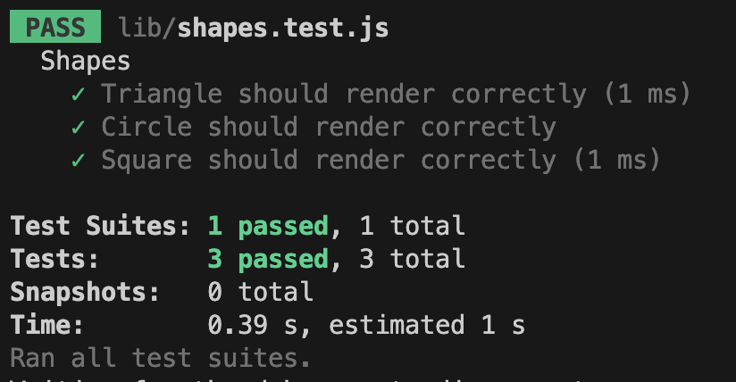

# SVG Artistry: Unleash Your Creativity with the Logo Maker!

Welcome to SVG Artistry, the ultimate SVG Logo Maker! This innovative console line application, built using Node.js and the powerful Inquirer library, empowers freelance web developers like you to create stunning logos for your projects without the need to hire a graphic designer.

## Requirements

Before you embark on your logo creation journey, ensure you have the following dependencies installed:

- [Node.js](https://www.nodejs.org/en)
- [Inquirer](https://www.npmjs.com/package/inquirer)

## Test-Driven Development (TDD) with Jest

At SVG Artistry, we are committed to delivering a robust and error-free experience. That's why we have implemented thorough testing using [Jest](https://www.npmjs.com/package/jest). Our code is carefully crafted to ensure smooth logo generation and reliability.

### ES6 Modules and Babel-Jest

Our project embraces the modern ES6 module system for imports and exports, providing a clean and organized codebase. As Jest is compatible with common JS imports and exports, we use [babel-jest](https://www.npmjs.com/package/babel-jest) to handle the necessary import/export conversions. This ensures seamless integration between Jest and our ES6 modules.

For your convenience, we have included essential configuration files, 'jest.config.cjs,' and '.babelrc.'

## Unleash Your Creativity: User Story

As a freelance web developer, you can now generate a simple, yet captivating logo for your projects, without the expense of hiring a graphic designer. The logo maker allows you to input up to three characters, choose the desired text color (via a color keyword or hexadecimal number), and select a shape from the available options: circle, triangle, or square. Additionally, you can customize the shape's color to complement your design.

## How to Use SVG Artistry

1. Open your terminal and navigate to the project directory.
2. Launch the application using Node.js.
3. Follow the prompts to enter your desired text, text color, and shape.
4. SVG Artistry will then create a magnificent logo for you, saved as `logo.svg`.
5. Marvel at your creation and showcase it to the world!

## Example Test Results

## See SVG Artistry in Action

Curious to see SVG Artistry in action? Check out our [Instructional Video]() for a step-by-step guide on how to create your perfect logo.

Unlock the artist within you with SVG Artistry! Happy logo making! 🎨✨
